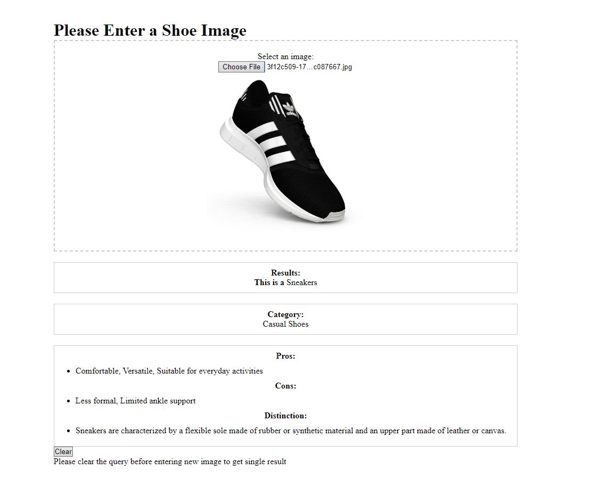
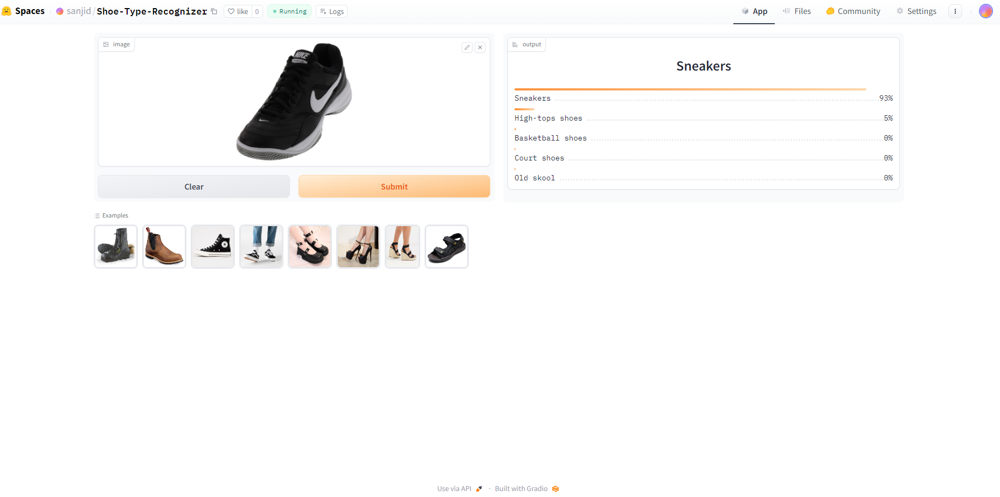

# Shoe-Type-Recognizer

An Image classification Model from Data collection, cleaning, model training as well as deployment and API integration 
The final app can classify 36 diffrent types of shoes for both male and female. 
[Click Here to Visit Web aplication](https://sanjidhossain.github.io/Shoe-Type-Recognizer/) 
### The App can Provide:
 1. The Type of shoes or the name of the shoes
 2. The Category of a Shoe(Boots, Heels,Dress shoes .etc)
 3. The App can Produce the positive sides and best feature as Pros.
 4. The App can also produce negative side and possible problem of a shoes as Con.
 5. The App can also provide the characteristics and key feature of each shoe as Distinction. 
     
Here is a sample of the Final application at work. 

 

## Types of Shoes and Their Categories are:

### Athletic Shoes:
   1. Basketball shoes
   2. Ballet flats
   3. Climbing shoes
   4. Golf shoes 
   5. High-tops shoes 
   6. Ice-skates shoes
   7. Running shoes
   8. Soccer shoes

### Boots:
   1. Army boots
   2. Chelsea Boot
   3. Cowboy boots
   4. Hiking boots
   5. Knee high boots
   6. Uggs
   7. Wellington boots 

### Cassual Shoes:
   1. Chuck Taylor
   2. Flip flop
   3. Old skool
   4. Sandal
   5. Sneakers
   6. Moccasin
   7. Mule shoes

### Dress Shoes:
   1. Brogues
   2. Derby shoe
   3. Dress shoe
   4. Loafer
   5. Oxford shoe

### Women's Heels:
   1. Cone heels
   2. Court shoes
   3. High heels
   4. Kitten heels
   5. Laced booties
   6. Lita shoe
   7. Mary Jane platforms
   8. Platform heels
   9. Wedges shoe

# Dataset Preparation
**Data Collection:** The data was collected by downloading from DuckDuckGo search using their term name  
**DataLoader:** Used fastai DataBlock API to set up the DataLoader where Resnet34 was used and was fine tuned multiple times.  
**Data Augmentation:** fastai provides default data augmentation which operates in GPU.  
Details can be found in `notebooks/Data_prep_for_capstone2.ipynb`

# Training and Data Cleaning
**Training:** Fine-tuned a resnet34 model for 5 epochs intially and then with 2 epochs for 4 times and got upto 89.6% accuracy.  
**Data Cleaning:** This part took the highest time. Since the collected data were from browser, there were many noises. Also, there were images that contained Animations, adds as well as there were garbage data that contains irrelevent subjects. The was cleaned and updated by using fastai library `ImageClassifierCleaner`.the data were cleaned each time after training and finetuning till the last time which was the final iteration of the model.  

# Model Deployment
The final model was deployed in HuggingFace Spaces using Gradio App. The implementation can be found in `deployment` folder or [here](https://huggingface.co/spaces/sanjid/Shoe-Type-Recognizer).  

# API integration with GitHub Pages
The deployed model API is integrated [here](https://sanjidhossain.github.io/Shoe-Type-Recognizer/) in GitHub Pages Website. Implementation and other details can be found in `docs` folder.
